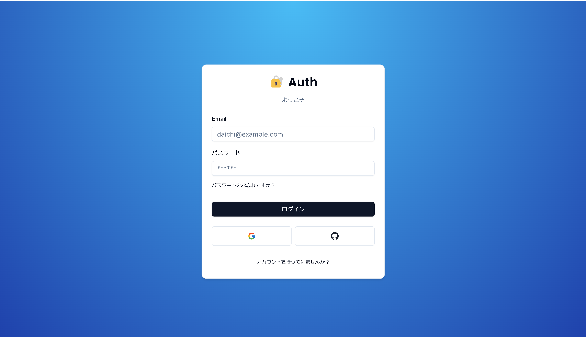
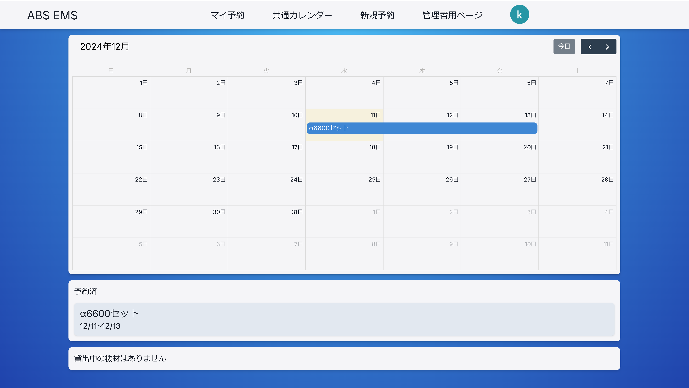
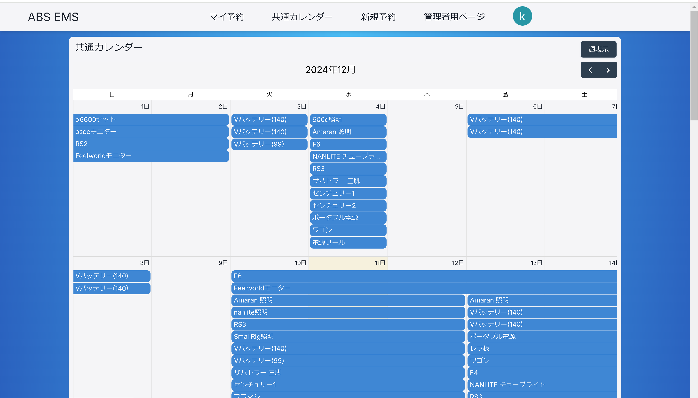
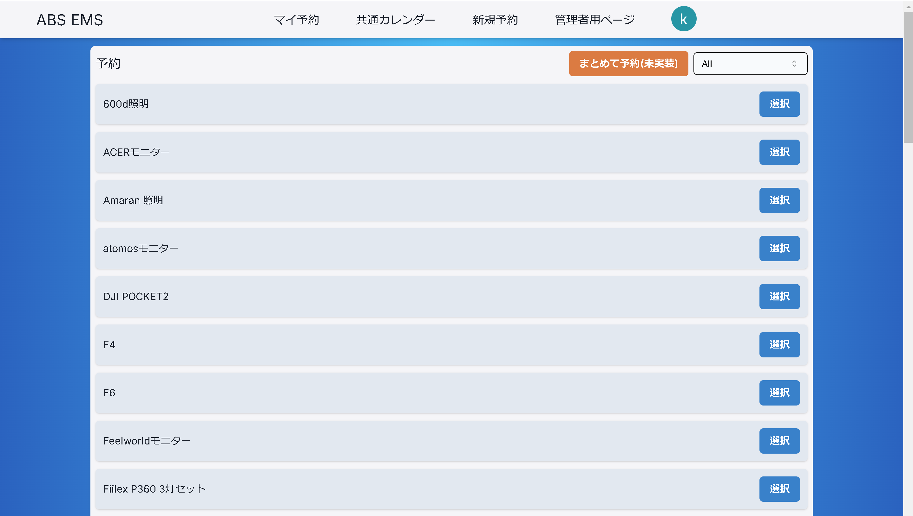
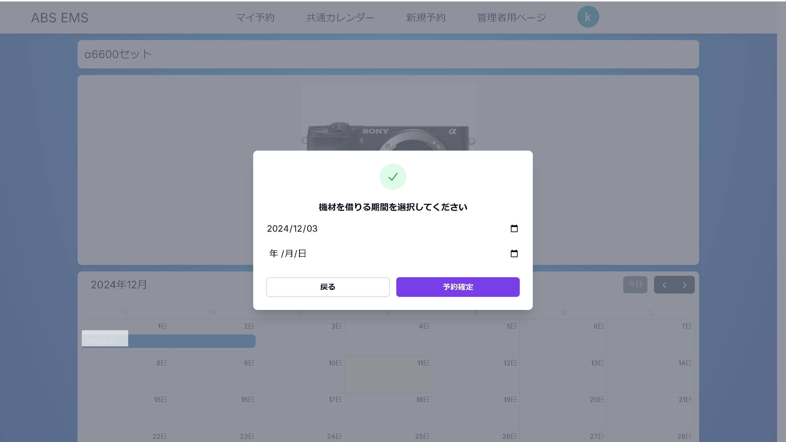
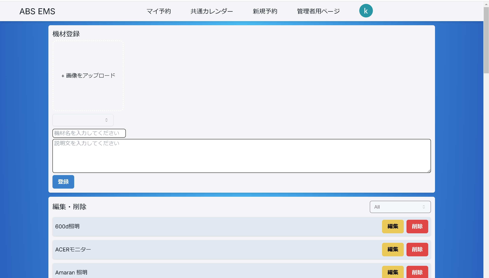
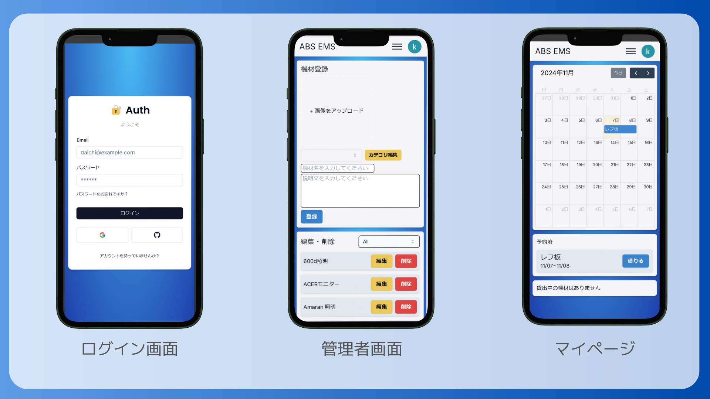
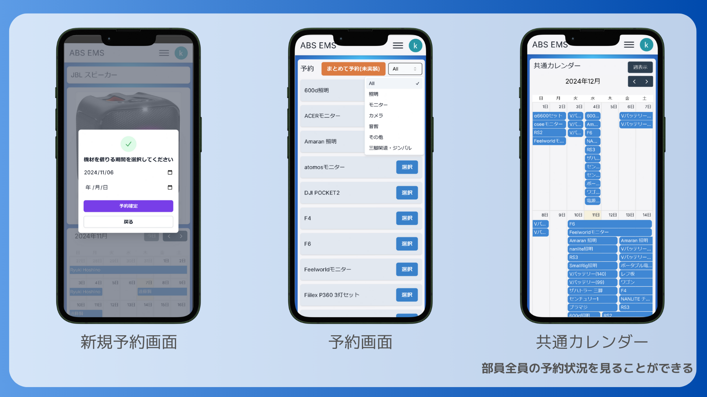
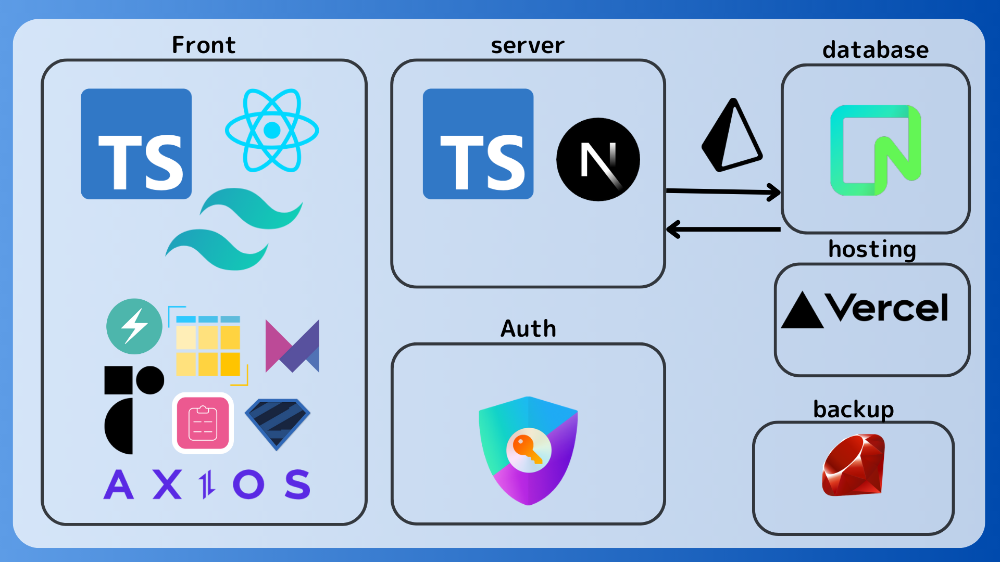

# ABS EMS
学内の放送部で使用する機材予約システムです。

このプロジェクトは **Next.js** を使用して構築された Web アプリケーションであり,
モダンなライブラリやフレームワークを活用しています。
- フロントエンド：
[@GO0128](https://github.com/GO0128)、
[@daichi0812](https://github.com/daichi0812)
- バックエンド：
[@Mii0829](https://github.com/Mii0829)
- プロジェクトリーダー: [@GO0128](https://github.com/GO0128)

約８か月で製作を行いました。実際に学内の放送部に使用していただいています。

## 作品概要
部員が放送部では多くの機材を管理しており、部員は必要時に借りて利用しています。しかし、以前まではテキストのみのやり取りであり、予約状況や機材の所在が把握しづらく、予約重複や情報の見落としが発生する問題がありました。

本プロジェクトではこのような問題を解決しています。

## 作品画像

### パソコン画面
ログインページ（メールアドレス・googleアカウント・githubアカウントでのログインが可能です。）

マイページ（自分の予約を確認・削除することができます）

共通カレンダー（部員全員の予約状況を見ることができます）

機材一覧（画面右上のタグ指定機能を使うことで、目的の機材をスムーズに見つけられます。）

新規予約（機材の詳細画面から予約ができます）

管理者画面（機材の追加・編集・削除ができます）

### スマホ画面
部員の多くはスマホで操作をすることを想定し、レスポンシブ対応もしています

## 特徴

- [NextAuth.js](https://next-auth.js.org/) を使用したユーザー認証とセッション管理
- Prisma を使用したデータベース管理
- Chakra UI と Radix UI によるカスタマイズ可能でアクセシブルな UI
- FullCalendar を使用したカレンダー機能とスケジュール管理
- アニメーション対応の Tailwind CSS を使用したスタイリング
- TypeScript による型安全な開発環境
- React Hook Form と Zod を使用したフォーム管理とスキーマバリデーション

## 技術スタック

### コア
- **[Next.js](https://nextjs.org/):** サーバーサイドレンダリングと静的サイト生成に対応した React ベースのフレームワーク
- **[React](https://reactjs.org/):** ユーザーインターフェイスを構築するためのフロントエンドライブラリ
- **[TypeScript](https://www.typescriptlang.org/):** 開発体験を向上させる型付き JavaScript

### 認証
- **[NextAuth.js](https://next-auth.js.org/):** 柔軟で安全な認証ソリューション
- **[Prisma](https://www.prisma.io/):** データベース統合とスキーマ管理のための ORM

### UI/UX
- **[Chakra UI](https://chakra-ui.com/):** モジュール型でカスタマイズ可能な UI コンポーネントライブラリ
- **[Radix UI](https://www.radix-ui.com/):** アクセシブルなデザインを構築するための非スタイル化 UI コンポーネント
- **[FullCalendar](https://fullcalendar.io/):** インタラクティブなカレンダーライブラリ
- **[Tailwind CSS](https://tailwindcss.com/):** ユーティリティファーストの CSS フレームワーク

### ユーティリティ
- **[React Hook Form](https://react-hook-form.com/):** 簡素化されたフォームバリデーションと管理
- **[Zod](https://zod.dev/):** TypeScript 初のスキーマバリデーション
- **[Axios](https://axios-http.com/):** Promise ベースの HTTP クライアント
- **[Moment Timezone](https://momentjs.com/timezone/):** 日時管理のためのタイムゾーンサポート
- **[UUID](https://www.npmjs.com/package/uuid):** ユニバーサル一意識別子の生成

### アニメーション
- **[Framer Motion](https://www.framer.com/motion/):** React 用アニメーションライブラリ
- **[tailwindcss-animate](https://github.com/tailwindlabs/tailwindcss-animate):** Tailwind CSS 用アニメーションユーティリティ

## 今後の展望
- 機材の一括貸出

